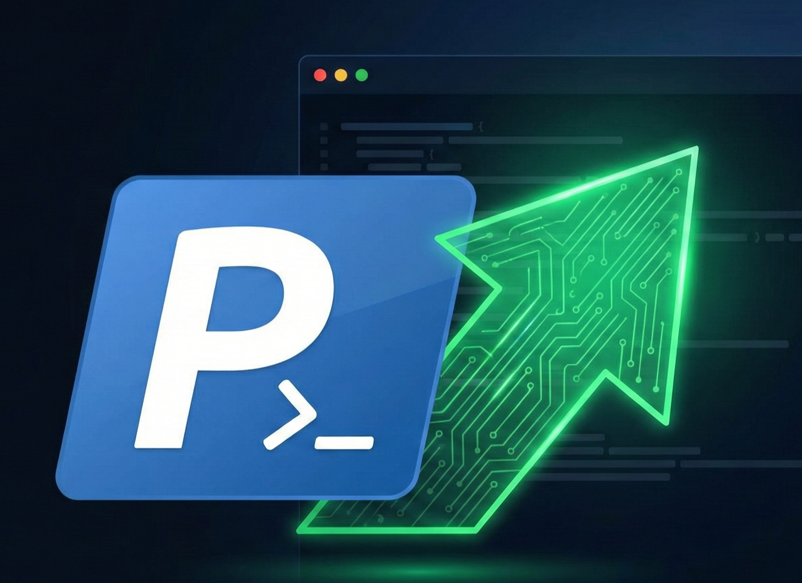

<p align="center">
  
</p>

# PowerShell Developer Profile Environment

Supercharge your Windows terminal experience. This project provides an automated setup script that configures your PowerShell $PROFILE with essential shortcuts, functions, and a structured development workflow for Git, Laravel, and React Native developers

Say goodbye to repetitive typing and hello to a faster, more enjoyable command line.

### Features

- **Instant Setup Wizard** -
  Run a single command to launch an interactive setup wizard. It automatically detects your profile, asks where you want to store your projects, creates the directory structure if needed, and injects all necessary configurations.

- **Interactive Help Menu** - Never forget a shortcut again. Type psh (or psh help) at any time to bring up a beautiful, color-coded cheat sheet of all available commands right in your terminal.

### Workflow Shortcuts

- **Git Essentials**

```bash
gs -> git status

ga -> git add . (Stage all changes)

gc "message" -> git commit -m "message"

gl -> A pretty, one-line graphical git log.
```

- **Laravel Development**

```
mklara <project-name> -> Scaffolds a new Laravel project inside your dedicated laravel projects folder and cd's into it.

pa <commands> -> Shorthand for php artisan. Example: pa migrate:fresh --seed.
```

- **React Native Development**

```
mkrnative <project-name> [version] -> Initializes a new React Native CLI project inside your dedicated react-native projects folder. Defaults to version 0.83.1 if unspecified.
```

- **Terminal Utilities**

```
dev -> Instantly jumps to your configured main development directory.

reload -> Reloads your profile configuration immediately without restarting the terminal session.

UTF-8 enforcement: Automatically fixes encoding issues so ASCII art and special characters display correctly.
```

### Prerequisites

To use all the included features, ensure you have the following installed:

- Windows PowerShell 5.1 or newer (PowerShell 7+ recommended)
- [Git for Windows](https://git-scm.com/install/windows)
- PHP and Composer (for Laravel Commands)
- Node.js

### Quick Installation

You can set up your entire environment with a single command.

1. Open a fresh PowerShell terminal window as an Administrator (recommended for first run to ensure permission to write the profile file).

2. Copy the command block below.

   ```ps
   Set-ExecutionPolicy Bypass -Scope Process -Force; [System.Net.ServicePointManager]::SecurityProtocol = [System.Net.ServicePointManager]::SecurityProtocol -bor 3072; iex ((New-Object System.Net.WebClient).DownloadString('https://raw.githubusercontent.com/fersonull/ps-shorts/main/main.ps1'))
   ```

3. Paste it into your terminal and press Enter.

4. Follow the on-screen prompts to set your development directory path.
